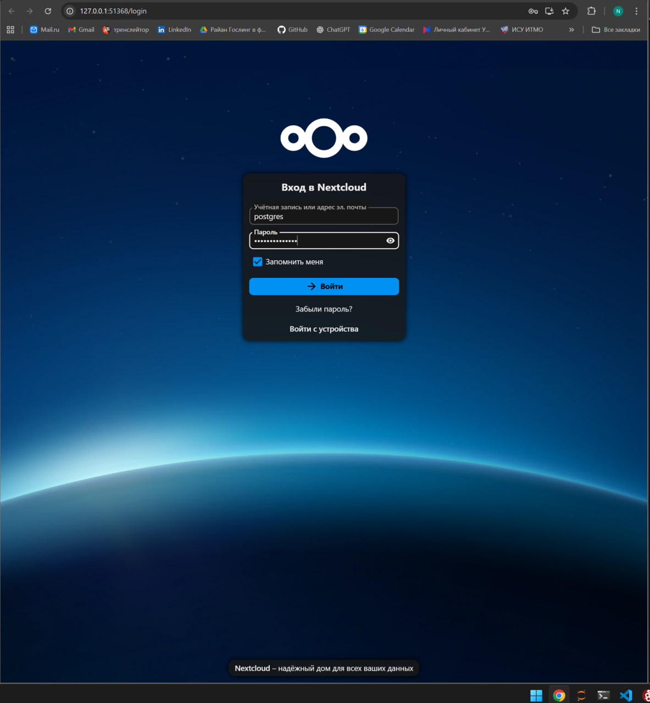

# ЛР 3. Nextcloud + Postgres в Kubernetes

Нужно было доработать манифесты из примера так, чтобы:

1. Для Postgres перенести переменные `POSTGRES_USER` и `POSTGRES_PASSWORD` из ConfigMap в Secret

2. Для Nextcloud вынести его переменные (`NEXTCLOUD_UPDATE`, `ALLOW_EMPTY_PASSWORD` и остальные подобные) из Deployment в ConfigMap

3. Для Nextcloud добавить `liveness` и `readiness` пробы

---

## 1. Postgres: перенос POSTGRES_USER и POSTGRES_PASSWORD в Secret

### Что было

В исходном варианте Postgres брал все переменные окружения из одного ConfigMap `postgres-configmap`:

- `POSTGRES_DB`
- `POSTGRES_USER`
- `POSTGRES_PASSWORD`

То есть логин и пароль лежали в явном виде в ConfigMap

### Что сделал

1. **Создал Secret `postgres-secret`**  
   Вынес в него переменные:

   ```yaml
   apiVersion: v1
   kind: Secret
   metadata:
     name: postgres-secret
   type: Opaque
   stringData:
     POSTGRES_USER: postgres
     POSTGRES_PASSWORD: supersecret
    ```

2. **Оставил в ConfigMap только несекретные данные**
    ```yaml
    apiVersion: v1
    kind: ConfigMap
    metadata:
        name: postgres-configmap
    data:
        POSTGRES_DB: nextcloud
    ```
    
3. **Обновил Deployment postgres**
    В контейнере Postgres теперь:

    ```yaml
    env:
    - name: POSTGRES_DB
        valueFrom:
        configMapKeyRef:
            name: postgres-configmap
            key: POSTGRES_DB

    - name: POSTGRES_USER
        valueFrom:
        secretKeyRef:
            name: postgres-secret
            key: POSTGRES_USER

    - name: POSTGRES_PASSWORD
        valueFrom:
        secretKeyRef:
            name: postgres-secret
            key: POSTGRES_PASSWORD
    ```

Таким образом:
- POSTGRES_USER и POSTGRES_PASSWORD больше не лежат в ConfigMap
- POSTGRES_USER и POSTGRES_PASSWORD остаются доступны контейнеру через Secret.

## 2. Nextcloud: перенос переменных в ConfigMap

### Что было
В Deployment nextcloud все переменные были «зашиты» прямо в манифест:

```yaml
env:
  - name: NEXTCLOUD_UPDATE
    value: "1"
  - name: ALLOW_EMPTY_PASSWORD
    value: "yes"
  - name: POSTGRES_HOST
    value: postgres-service
  - name: NEXTCLOUD_TRUSTED_DOMAINS
    value: "127.0.0.1"
```

### Что сделал
1. **Создал ConfigMap nextcloud-configmap**  
   Вынес туда не секретные переменные Nextcloud:

   ```yaml
    apiVersion: v1
    kind: ConfigMap
    metadata:
        name: nextcloud-configmap
    data:
        NEXTCLOUD_UPDATE: "1"
        ALLOW_EMPTY_PASSWORD: "yes"
        POSTGRES_HOST: "postgres-service"
        NEXTCLOUD_TRUSTED_DOMAINS: "127.0.0.1"
    ```

2. **Подключил этот ConfigMap в Deployment nextcloud**
    Внутри контейнера Nextcloud добавил envFrom:
    ```yaml
    envFrom:
    - configMapRef:
        name: nextcloud-configmap
    ```
3. **Оставил чувствительные переменные через Secret/ConfigMap для Postgres**
    Внутри контейнера Nextcloud добавил envFrom:
    ```yaml
    env:
    - name: POSTGRES_DB
        valueFrom:
        configMapKeyRef:
            name: postgres-configmap
            key: POSTGRES_DB

    - name: POSTGRES_USER
        valueFrom:
        secretKeyRef:
            name: postgres-secret
            key: POSTGRES_USER

    - name: POSTGRES_PASSWORD
        valueFrom:
        secretKeyRef:
            name: postgres-secret
            key: POSTGRES_PASSWORD

    - name: NEXTCLOUD_ADMIN_USER
        value: admin

    - name: NEXTCLOUD_ADMIN_PASSWORD
        valueFrom:
        secretKeyRef:
            name: nextcloud-secret
            key: NEXTCLOUD_ADMIN_PASSWORD
    ```
Отдельно существует Secret nextcloud-secret с полем NEXTCLOUD_ADMIN_PASSWORD

Таким образом:
- переменные `NEXTCLOUD_UPDATE`, `ALLOW_EMPTY_PASSWORD`, `POSTGRES_HOST`, `NEXTCLOUD_TRUSTED_DOMAINS` теперь живут не в `Deployment`, а в ConfigMap nextcloud-configmap

## 3. Nextcloud:добавлены Liveness и Readiness пробы

### Что было
У Deployment nextcloud не было никаких health-checks, кубер не проверял, жив ли сервис

### Что сделал
Добавил две пробы на HTTP-endpoint /status.php (это стандартная точка статуса у Nextcloud):

   ```yaml
    livenessProbe:
        httpGet:
            path: /status.php
            port: 80
        initialDelaySeconds: 60
        periodSeconds: 30
        timeoutSeconds: 5
        failureThreshold: 3

    readinessProbe:
        httpGet:
            path: /status.php
            port: 80
        initialDelaySeconds: 30
        periodSeconds: 10
        timeoutSeconds: 5
        failureThreshold: 3
```

- Liveness отвечает за перезапуск контейнера, если Nextcloud перестал отвечать
- Readiness говорит куберу, когда под готов принимать трафик (пока установка/инициализация не закончена — трафик не шлётся)

После всех правок:

```
kubectl apply -f pg_configmap.yaml
kubectl apply -f pg_secret.yaml
kubectl apply -f pg_deployment.yaml

kubectl apply -f nextcloud_configmap.yaml
kubectl apply -f nextcloud_deployment.yaml
```



## Вопросы  
**1. Что произойдёт, если отскейлить количество реплик postgres-deployment в 0, затем обратно в 1, а после зайти в Nextcloud? Почему?**

Если Postgres скейлится в **0**, база исчезает:  
- пода нет
- сервиса не существует
- подключения принимать некому

В этот момент Nextcloud начнёт падать по readiness/liveness, потому что он не может достучаться до базы -> cайт не откроется

Если Postgres вернуть обратно в **1**, под поднимется, восстановит сокет и начнёт слушать порт 

**2. Важен ли порядок выполнения манифестов? Почему?**

Да, тк разные манифесты зависят друг от друга, если применить их в случайном порядке, часть подов не запустится

#### На примере третьей лабы:

**1. Nextcloud зависит от Postgres**  

Nextcloud не может стартовать, пока база не работает. Если сначала развернуть Nextcloud, а Postgres позже, то контейнер будет падать с ошибкой подключения и не пройдёт readiness/liveness пробы

**2. Nextcloud зависит от своих ConfigMap и Secret**

Если применить deployment раньше, чем появятся ConfigMap и Secret, Kubernetes сразу выдаст ошибку

**3. Postgres сам зависит от своих Secret/ConfigMap**

Если применить deployment раньше, чем секреты, то он тоже не стартанет
